# Hello word

**NIM**: 2241720136  
**Nama**: Ahmad Mumtaz Haris 

### Menghubungakan ke android
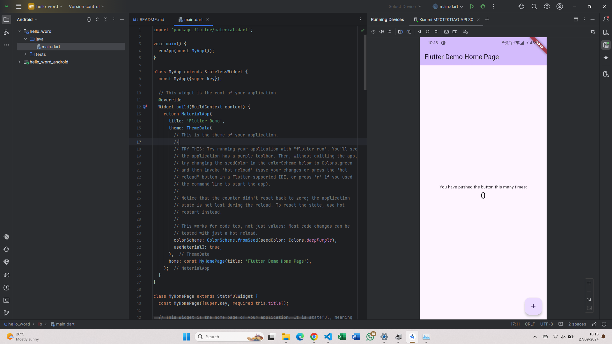
Pada langkah ini, saya menghubungkan ke android melalui kabel USB dengan mengaktifkan USB debungging

---
### Praktikum 3
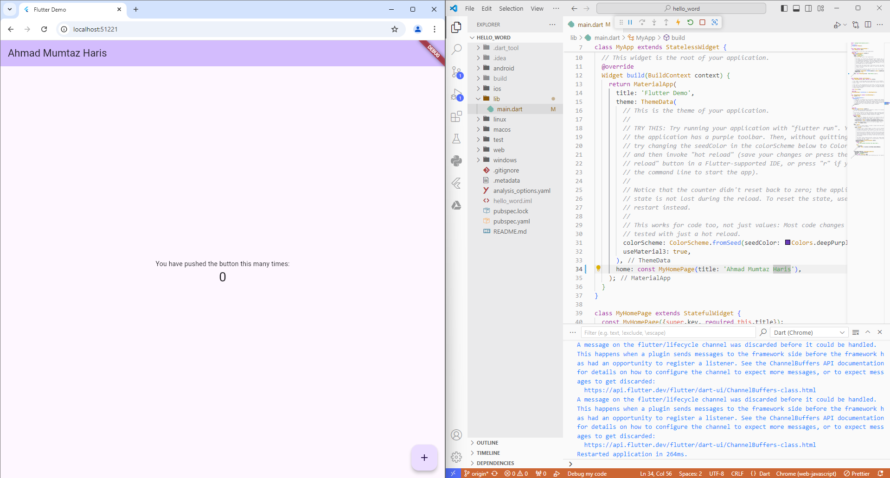
Langkah ini merupakan tahapan awal, yaitu membuat project baru hello_word

---
### Praktikum 4
- #### Text widget
    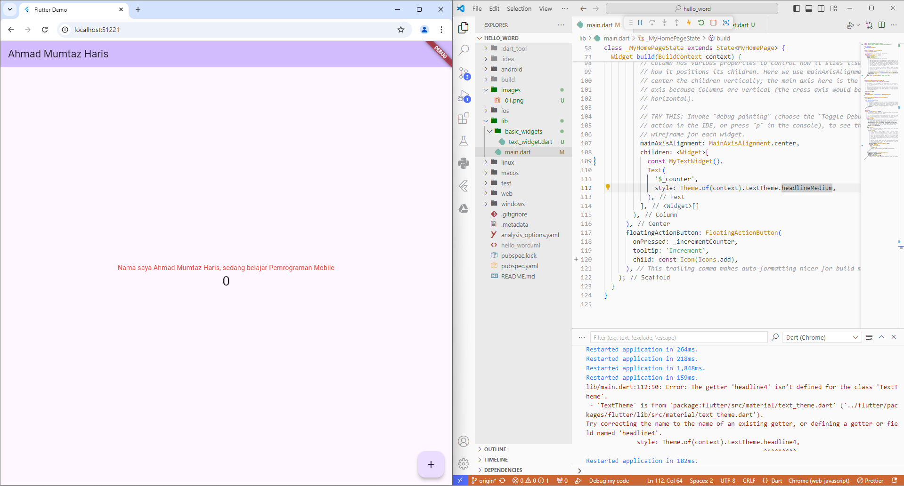
    widget statis bernama MyTextWidget yang menampilkan teks berwarna merah dan berukuran 14, dengan teks diratakan di tengah. Widget ini menggunakan StatelessWidget, sehingga konten tidak berubah selama siklus hidupnya,

- #### Image widget
    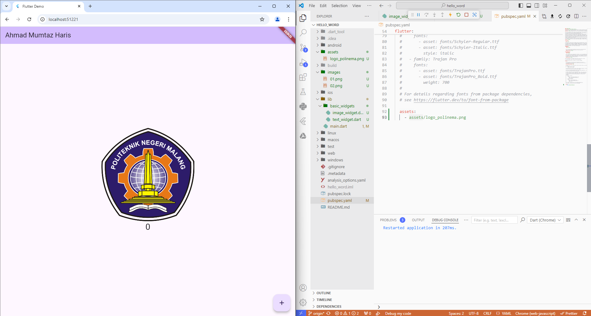
    sebuah widget Flutter bernama MyImageWidget yang merupakan subclass dari StatelessWidget. Widget ini akan menampilkan gambar statis yang diambil dari file aset lokal bernama logo_polinema.jpg

---
### Praktikum 5
- #### Langkah 1
    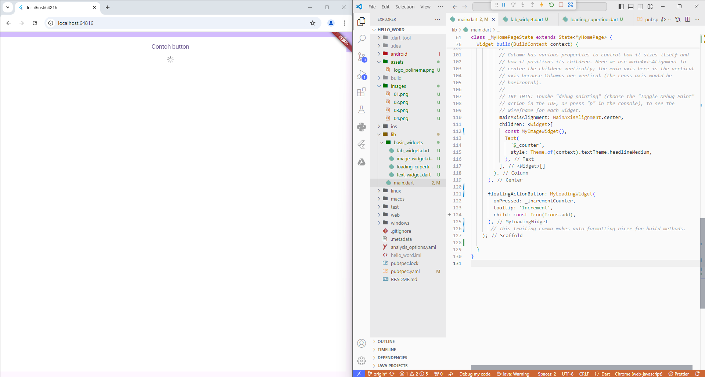
    Merupakan tombol dan indikator loading, tetapi tombol ini masih belum bisa digunakan

- #### Langkah 2
    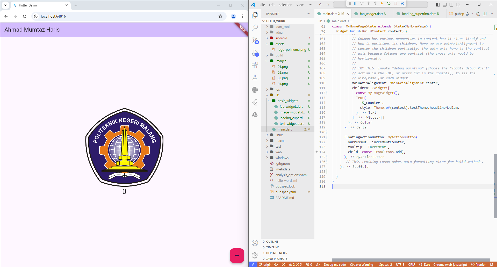
    Mengubah tombol menjadi berwarna pink

- #### Langkah 3
    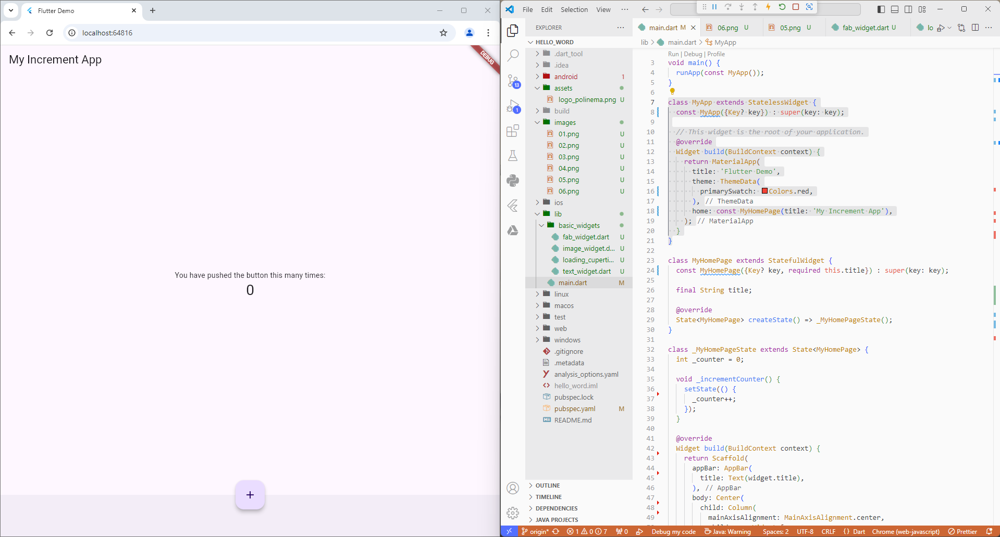
    Scaffold widget digunakan untuk mengatur tata letak sesuai dengan material design. Menggunakan StatefulWidget untuk memperbarui tampilan, aplikasi memiliki sebuah angka (counter) yang bertambah setiap kali tombol floating action button (FAB) ditekan. Teks di tengah layar menunjukkan jumlah klik, dengan FAB berada di bagian bawah tengah layar yang diatur menggunakan FloatingActionButtonLocation.centerDocked.

- #### Langkah 4
    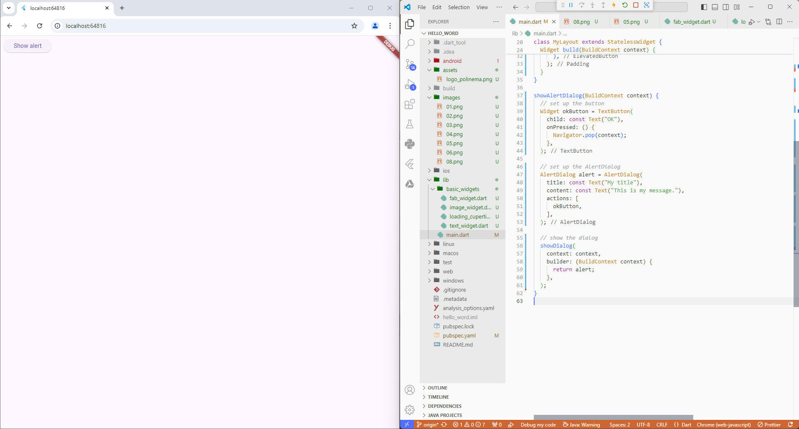
    Menggunakan dua StatelessWidget, yaitu MyApp dan MyLayout. MyApp membungkus tampilan utama menggunakan MaterialApp dan menampilkan widget Scaffold dengan body berupa widget MyLayout. Di dalam MyLayout, terdapat tombol dengan teks "Show alert", dan ketika ditekan, tombol tersebut memanggil fungsi showAlertDialog, yang akan menampilkan dialog peringatan (AlertDialog). Dialog tersebut berisi judul "My title", pesan "This is my message.", dan satu tombol "OK" yang akan menutup dialog ketika ditekan.

- #### Langkah 5
    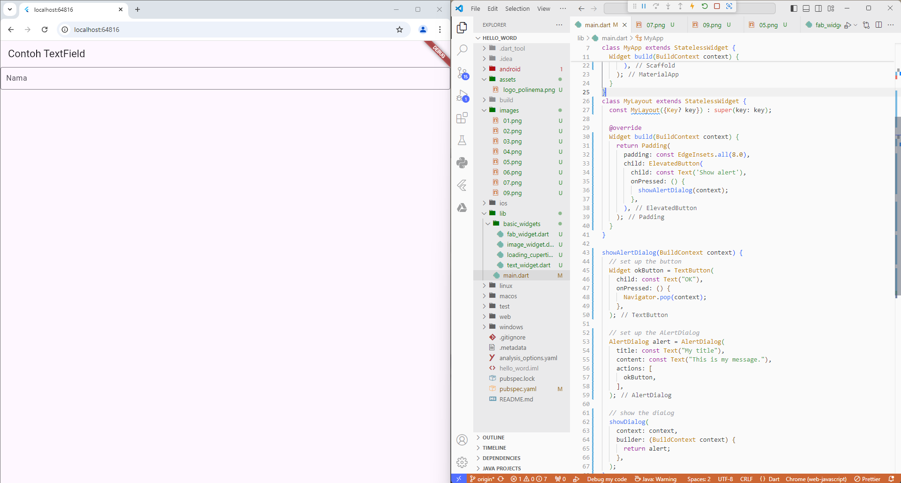
    Kode ini menampilkan aplikasi Flutter yang terdiri dari sebuah TextField di dalam Scaffold dengan AppBar. TextField ini digunakan untuk menerima input teks dari pengguna, dengan label "Nama". Komponen ini tidak menyembunyikan input (karena obscureText: false)

- #### Langkah 6
    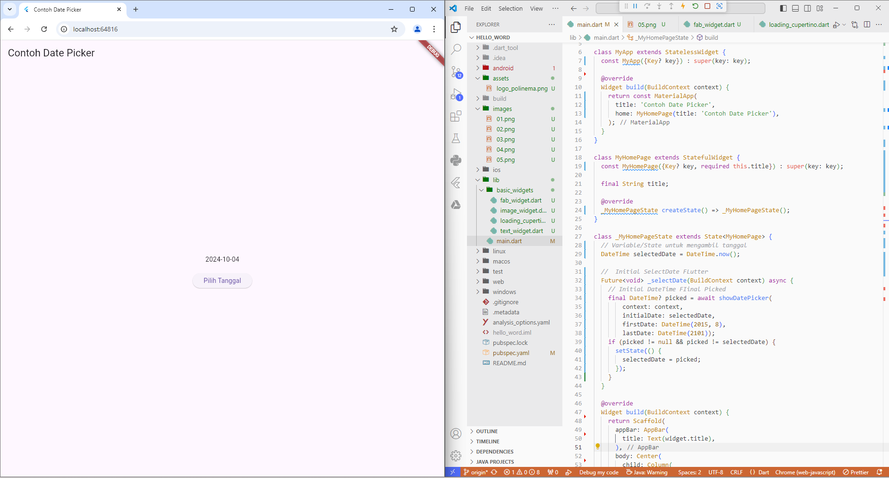
    menggunakan StatefulWidget untuk menyimpan tanggal yang dipilih oleh pengguna. Awalnya, tanggal diatur pada nilai saat ini (DateTime.now()). Ketika pengguna menekan tombol "Pilih Tanggal", aplikasi akan memunculkan showDatePicker, sebuah dialog yang memungkinkan pengguna memilih tanggal dari rentang yang ditentukan (mulai dari Agustus 2015 hingga tahun 2101)

---
### Tugas Praktikum
Tugas praktikum yang dilakukan adalah mengubah praktikum 5 mulai dari langkah 3 hingga 6 menjadi file widget di folder basic_widgets yang kemudian di import pada main. FIle widget tersebut adalah home_page.dart, my_app.dart, my_layout.dart
- #### Praktikum 5 langkah 3
     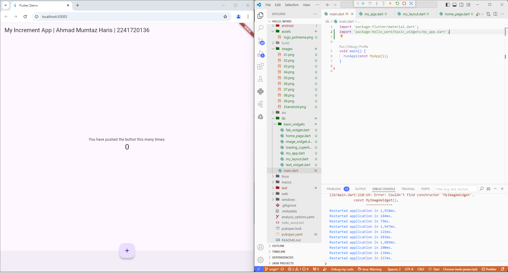
- #### Praktikum 5 langkah 4
     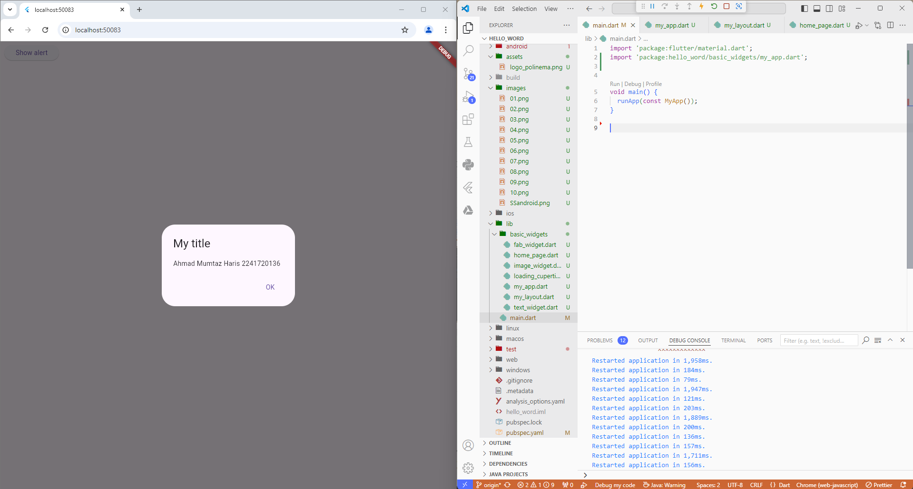
- #### Praktikum 5 langkah 5
     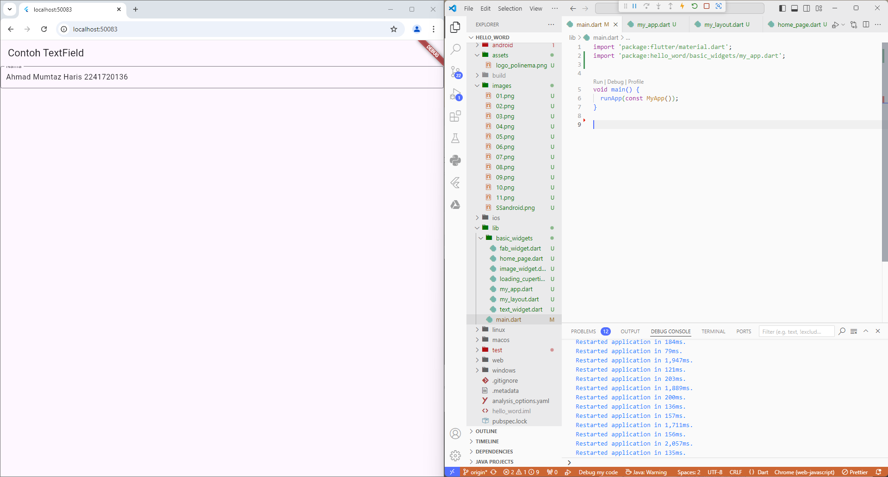
- #### Praktikum 5 langkah 6
     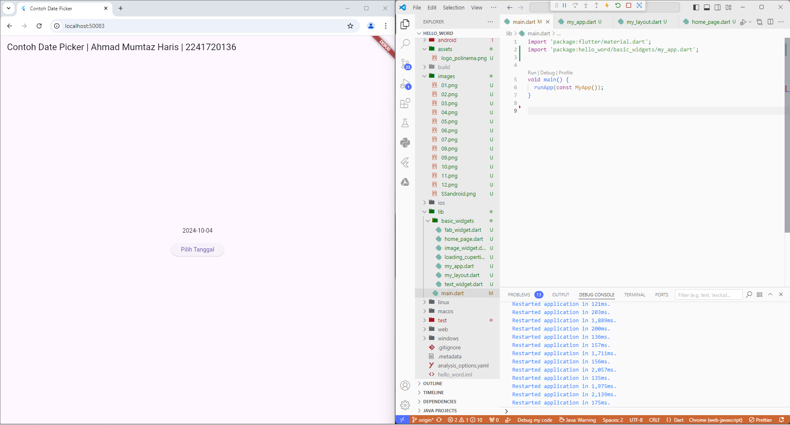
